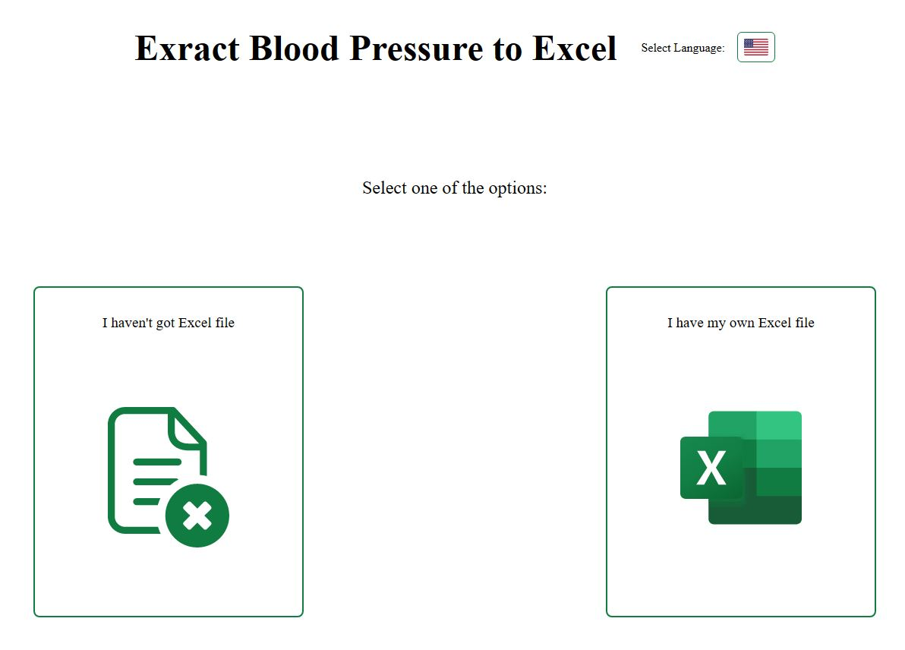
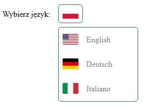

# Extract Blood Pressure to Excel

> See demo live : [click here]( 'click to open link')

## Description

The app wrote to solve problem of transferring blood pressure data from notepad to Excel file. You can choose one from the 4th available languages to adapt content of app. There is possibility to choose two option of adding new data:

1.  Creating new Excel file with provided data by text box.
2.  Adding data to chosen Excel file from text box.
     
    The main goal was to write an app with minimalistic design but functional.
     
    The app adapted only for computer screens with width above 850px.

## Features

- Dropdawn menu with languages
  
- Translation of content in 4th languages
- Text box with validation of provided data
- Pointing invalid lines in text box and showing this information below text box
- Creating new Excel file with provided data from text box
- Adding data from text box to chosen Excel file
- Validation of chosen Excel file
- Notifications about user errors

## Built using

- React
- Typescript
- Styled Components
- React Router v6
- React Custom Hooks
- i18next
